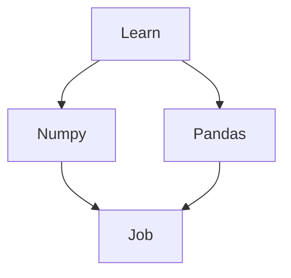

# Pandas_Learning_Steps
## First Learn **_Numpy_** and Second **_Pandas_**

>Use My Jupyter Book and Read Documentation
  * [Numpy_Documentation](https://numpy.org/doc/)
  * [Pandas_Documentation](https://pandas.pydata.org/docs/)
 

> Subsequent Steps to Learn Pandas  from Numpy and Pandas Python Library/Module

- [x] #739
- [ ] https://github.com/octo-org/octo-repo/issues/740
- [ ] Add delight to the experience when all tasks are complete :tada:

@Abhishek :+1: Keep Learning :innocent:	

